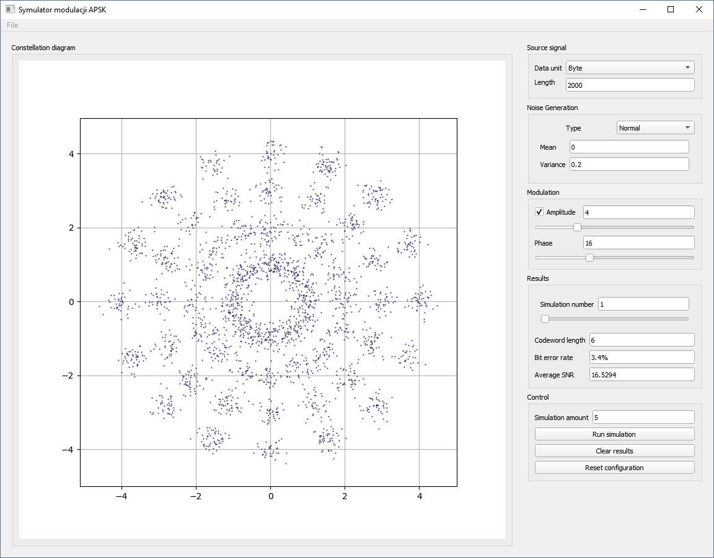

## Temat projektu
### _Analiza metod modulacji PSK i APSK._

### Autorzy
- [Maja Bojarska](https://github.com/majabojarska)
- [Wojtek Śliwa](https://github.com/vanill4Sky)
- [Wojtek Sadlik](https://github.com/SmutnyPan)

### Release

- [Windows executable](https://github.com/majabojarska/NiDSC-projekt/releases/download/v1.0/Symulator_APSK.exe)

[Wprowadzenie do projektu NiDSC](http://www.zsk.ict.pwr.wroc.pl/zsk/repository/dydaktyka/ndsc/projekt_wprowadzenie_2018.pdf)
****